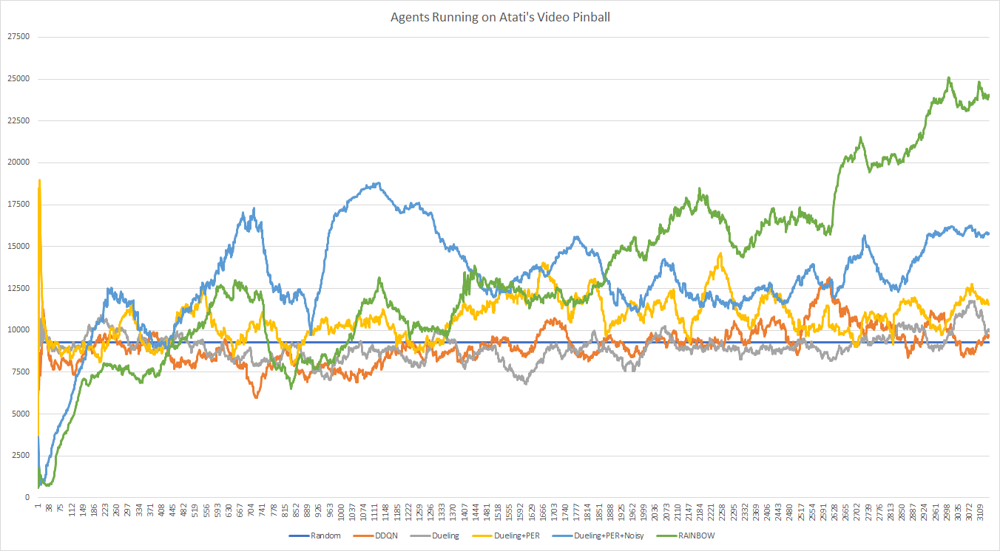
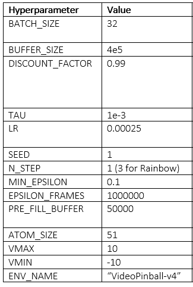

# Reinforcement-Learning-Agent
This was primarily designed for Atari's VideoPinball-v4, but should be compatible with other atari games given a few tweaks.

To choose your agent alter the booleans within the agent_options variable, not all combinations are currently implemented so ensure your configuration is in the 'choices list'.

The config.py file contains all hyperparameters to change.

Findings on VideoPinball

We used the hyperparameters below:
 

To record a video of agent you can add a monitor around the make_env method in train_agent.

Future work:
Add functionality to run any combination of algorithms.
